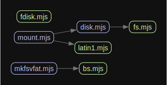

# LibMount

[](https://github.com/vip-delete/libmount/actions/workflows/ci.yaml)
[](https://github.com/prettier/prettier)
[](https://www.npmjs.com/package/libmount)

Standalone FAT12, FAT16, FAT32, VFAT implementation in JavaScript

## Features

1. No dependencies.
1. Supported filesystems: FAT12, FAT16, FAT32 including LFN (Long File Names) extension.
1. Format volume with multiple parameters like "mkfs.vfat" in Linux.
1. Mount or create disk partitions like "fdisk".
1. Typescript friendly.
1. Tiny: 20KB of full bundle.mjs, ~9KB in gzip.

## Installation

```
npm install libmount
```

or use CDN:

```html
<script type="importmap">
  {
    "imports": {
      "libmount": "https://cdn.jsdelivr.net/npm/libmount@0.5.0/dist/libmount.mjs"
    }
  }
</script>
```

## Basic API

See the public API in [libmount.d.mts](dist/libmount.d.mts)

```javascript
/**
 * Random-access storage device interface.
 */
type RandomAccessDriver = {
  /**
   * The total size of the storage device in bytes.
   * @readonly
   */
  capacity: number;

  /**
   * Reads a specific chunk of data from the device.
   * @param address - The byte offset to begin reading from. Must be >= 0 and < capacity.
   * @param count - The number of bytes to read.
   * @returns {Uint8Array} A buffer containing the requested data.
   */
  read(address: number, count: number): Uint8Array;

  /**
   * Writes data to the device at a specific offset.
   * @param address - The byte offset to begin writing to.
   * @param data - The buffer containing data to write.
   */
  write(address: number, data: Uint8Array): void;
};

/**
 * Mount
 * @param driver - Driver.
 * @param options - Mount options.
 * @returns A mounted disk.
 */
function mount(driver: RandomAccessDriver, options?: MountOptions): Disk;
```

```javascript
import { mount } from "libmount";
const disk = mount(driver);
const fs = disk.getFileSystem();
const data = fs.getRoot().getFile("kernel.sys").open()?.readData(); // Uint8Array
```

See more [examples](examples)

You can use a driver to access your hardware devices (e.g., /dev/sdb or \\.\PhysicalDrive1) or large disk images without loading the entire disk into memory.

```javascript
const driver = {
  capacity,
  read: (address, count) => { ... },
};
const disk = mount(driver);
```

See [raw-disk.mjs](examples/raw-disk.mjs)

## Constants, Types, Misc

| File                       | Description                    |
| -------------------------- | ------------------------------ |
| [const.mjs](src/const.mjs) | FAT specification constants.   |
| [log.mjs](src/log.mjs)     | Console logger.                |
| [types.mjs](src/types.mjs) | FAT structures and interfaces. |
| [utils.mjs](src/utils.mjs) | Various FAT utility functions. |

## Classes and Functions

| File                         | Description                                                 |
| ---------------------------- | ----------------------------------------------------------- |
| [bs.asm](src/bs.asm)         | Default boot loader written in NASM                         |
| [bs.mjs](src/bs.mjs)         | Auto-generated from bs.asm.                                 |
| [dao.mjs](src/dao.mjs)       | FAT structures Data Access functions: readers & writers     |
| [disk.mjs](src/disk.mjs)     | Disk impl. It can have FileSystem or Partition Table.       |
| [fs.mjs](src/fs.mjs)         | FileSystem impl.                                            |
| [io.mjs](src/io.mjs)         | Reader/Writer class on top of Uint8Array and a Driver impl. |
| [latin1.mjs](src/latin1.mjs) | Latin1 aka ISO-8859-1 codepage.                             |

## Exported Functions

| File                             | Description                                   |
| -------------------------------- | --------------------------------------------- |
| [mkfsvfat.mjs](src/mkfsvfat.mjs) | Make FAT filesystem function (format volume). |
| [fdisk.mjs](src/fdisk.mjs)       | Make Partition Table function.                |
| [mount.mjs](src/mount.mjs)       | Mount function.                               |

## Dependency Diagram

Class dependencies digram excluding "support" classes (const, log, types, utils, dao, io) which are used everywhere



## Abstract

🐕 The **libmount** implements the FAT specification from scratch (FAT12, FAT16, FAT32) in pure JavaScript just for fun and because there is no similar library except the outdated [fatfs](https://github.com/natevw/fatfs). The **libmount** is developed using the following JavaScript libraries: Stylistic, Vitest, ESLint, Prettier, and, most importantly, Closure Compiler (CC). It does the job much better than TypeScript + any minifier. Let me know if you disagree or find any replacement for CC!

🏆 The **libmount** supports almost everything from the FAT specification: long filenames (LFNs), OEM charsets (codepages), and file manipulations such as listing, creating, renaming, moving, reading, writing, and deleting files. In addition, the library supports partitioned disk images, create (format) volumes and provides type definitions for TypeScript.

💡 The FAT specification requires an OEM charset to encode and decode short filenames (SFNs), also known as 8.3 names. SFNs can include uppercase letters, digits, characters with code point values greater than 127, and certain special characters. Code points above 127 are used for national symbols, such as Cyrillic (CP1251), Japanese (CP932), Arabic (ISO 8859-6), and others. If the FAT image contains SFNs with code points above 127, it is crucial to specify the correct codepage to decode the filenames accurately, rather than seeing garbled text like ïðèâåò. By default, libmount uses **latin1**. You can find more codepages in [iconv-tiny](https://github.com/vip-delete/iconv-tiny) package, it is fully compatible with **libmount**.

🌟 The long filenames (LFNs) are designed to bypass 8.3 SFNs and OEM charset limitations. LFNs always use 16 bits per character (UTF-16) instead of 8 bits for SFNs. LFNs also support Unicode surrogate pairs. For example, the filename '😀' consists of two UTF-16 code units and is encoded in 4 bytes [3D, D8, 00, DE]. By the way, JavaScript also uses UTF-16, which makes translation from JavaScript strings to LFN bytes easy. The funny thing is that `'😀'.length` returns `2` for just one visible character. Please give a star to this project if you are surprised.

## Full Example

```javascript
// examples/1.mjs
import { readBinaryFileSync } from "../scripts/commons.mjs";
import { mount } from "../src/index.mjs";
// import { mount } from "libmount";

/**
 * @param {import("libmount").File} file
 */
const print = (file) => {
  console.log(file.getAbsolutePath());
  file.listFiles()?.forEach(print);
};

const img = readBinaryFileSync("./images/freedos722.img");
const disk = mount(img);
let fs = disk.getFileSystem();

if (!fs) {
  // check filesystem on 1st disk partition
  const partitions = disk.getPartitions();
  if (partitions.length) {
    const partition = partitions[0];
    console.log(`Found partition of type: ${partition.type}`);
    fs = mount(img, { partition }).getFileSystem();
  }
  if (!fs) {
    throw new Error("FileSystem is not detected");
  }
}

const sizeOfCluster = fs.getSizeOfCluster();
const countOfClusters = fs.getCountOfClusters();
const freeClusNum = fs.getFreeClusters();
const used = (countOfClusters - freeClusNum) * sizeOfCluster;
const free = freeClusNum * sizeOfCluster;

console.log(`
FileSystem Type: ${fs.getName()}
          Label: ${fs.getLabel()}
        OEMName: ${fs.getOEMName()}
   SerialNumber: 0x${fs.getId().toString(16).toUpperCase()}
  SizeOfCluster: ${sizeOfCluster}
CountOfClusters: ${countOfClusters}
   FreeClusters: ${freeClusNum}
     Used Space: ${used} bytes
     Free Space: ${free} bytes (${Math.round((freeClusNum * 100) / countOfClusters)}%)
`);

const root = fs.getRoot();

// file and dirs example manipulation
root.makeDir("/tmp");
root.makeFile("/test/foo.txt");
root.getFile("/test")?.moveTo("/tmp");

// file writing and reading example
const file = root.makeFile(".Hello[World]..txt");
if (file) {
  file.open()?.writeData(new TextEncoder().encode("😀😀😀"));
  const data = file.open()?.readData();
  if (data) {
    console.log(`
       FileSize: ${file.length()}
           Name: ${file.getName()}
      ShortName: ${file.getShortName()}
        Content: ${new TextDecoder().decode(data)}
   CreationTime: ${file.getCreationTime()?.toLocaleString()}
`);
  }
}

// list all files recursive:
print(root);
```

```
$ node ./examples/1.mjs

FileSystem Type: FAT12
          Label: FREEDOS
        OEMName: FreeDOS
   SerialNumber: 0xE4C95CE8
  SizeOfCluster: 1024
CountOfClusters: 713
   FreeClusters: 45
     Used Space: 684032 bytes
     Free Space: 46080 bytes (7%)


       FileSize: 12
           Name: .Hello[World]..txt
      ShortName: _HELLO~1.TXT
        Content: 😀😀😀
   CreationTime: 2/16/2025, 6:05:00 PM

/
/KERNEL.SYS
/COMMAND.COM
...
/tmp
/tmp/test
/tmp/test/foo.txt
/.Hello[World]..txt
```

## Commands

Build:

```
npm run build
```

UI Demo:

```
npm run dev
```

Compile (optional, you need JDK 21 or higher installed):

```
npm run compile
```
